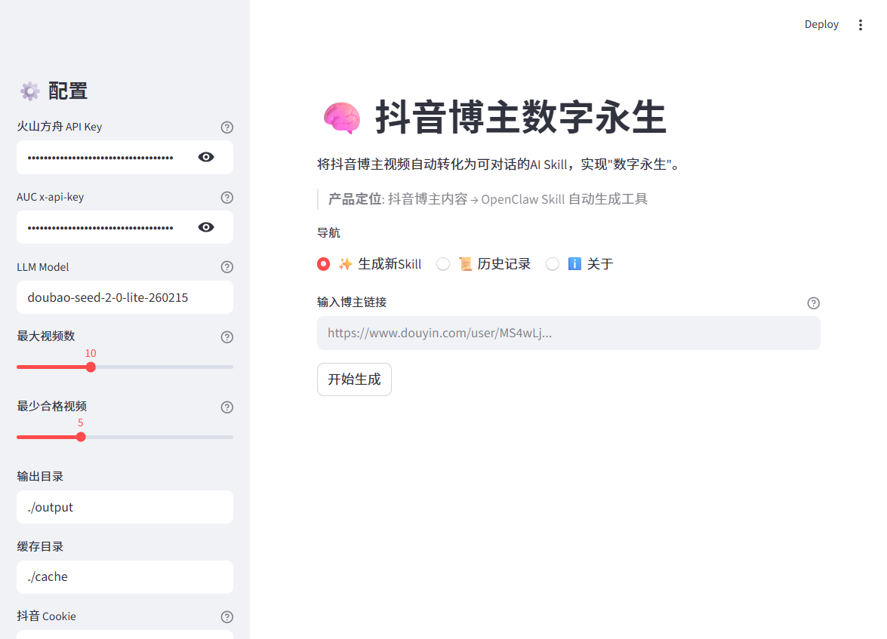
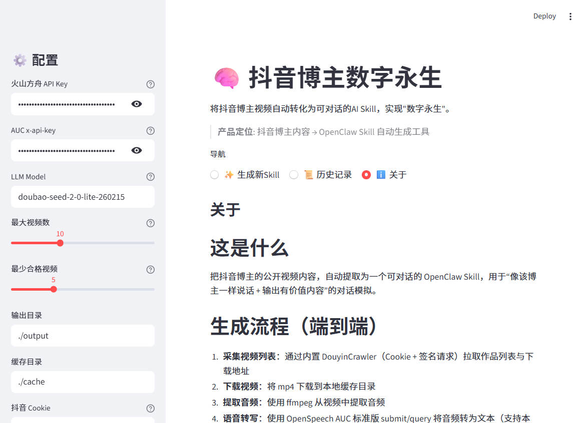

# 🧠 抖音博主数字永生 (Douyin Blogger Digital Immortality)

> **产品定位**: 抖音博主内容 → OpenClaw Skill 自动生成工具

这是一个端到端的生成引擎与 Web UI，它能抓取任意抖音博主的公开视频，提取其“内容领域”、“表达风格”、“人设标签”和“口头禅”，并最终自动生成一个可用于对话的 [OpenClaw Skill](https://github.com/openclaw/openclaw)（`SKILL.md` 格式）。生成后，你可以像和该博主本人聊天一样与 AI 进行互动。

---

## 👀 界面预览





## 🌟 核心特性

- **一键全自动**：输入博主主页链接，自动完成“采集 -> 下载 -> 转写 -> 过滤 -> 安全检测 -> AI分析 -> 生成 Skill”全流程。
- **高纯度提取**：宁缺毋滥的过滤机制（剔除纯音乐、多人对话、过短/过长文本），确保用来训练 AI 的样本纯度。
- **基于火山引擎生态**：
  - ASR：对接 **OpenSpeech AUC (标准版)** 进行高精度语音转文字。
  - LLM：对接 **火山方舟 (Doubao-Seed-2.0-lite)** 进行低成本、快速的风格分析与 Prompt 编写。
- **无缝集成 OpenClaw**：输出标准的 `SKILL.md`（YAML Frontmatter + Markdown 正文），支持直接拖入 OpenClaw 的 skills 目录使用。
- **直观的 Streamlit UI**：提供细粒度的阶段进度条、日志查看、在线对话测试（流式输出）及历史记录管理。

## 🏗️ 工作流

1. **采集视频**：内置基于协议的 DouyinCrawler（无需浏览器驱动），极速抓取无水印视频下载地址。
2. **下载与提取**：本地缓存 mp4 并使用 `ffmpeg` 提取音频。
3. **语音转写**：将音频提交至火山 OpenSpeech AUC 接口获取带时间戳的转写文本。
4. **数据清洗**：剔除无价值内容。
5. **安全检测**：多层拦截（关键词匹配 + LLM）暴力、低俗、违规等不良信息。
6. **AI 生成**：
   - 总结博主画像（内容领域、目标受众等）
   - 提取风格规则（句式、情绪、口头禅）
   - 编写最终的 System Prompt 和触发词
7. **自动化评估**：对生成的 Skill 进行纯度、风格还原度和可用性打分，最终落盘。

## 🚀 快速开始

### 1. 环境准备

- **Python**: 3.10+
- **FFmpeg**: 必须安装并添加到系统环境变量。

```bash
git clone https://github.com/xiaoweiya2018/dyupSkills.git
cd dyupSkills
pip install -r requirements.txt
```

### 2. 获取密钥与配置

由于本项目完全基于火山引擎，你需要在启动前准备好以下信息：

1. **火山方舟 API Key** (`ARK_API_KEY`)：前往[火山方舟控制台](https://console.volcengine.com/ark)申请。
2. **火山 AUC x-api-key**：前往火山语音开放平台获取大模型录音文件识别标准版的 Key。
3. **抖音 Cookie**：打开浏览器开发者工具，抓取任意抖音网页版请求中的完整 `Cookie:` 字段。

### 3. 启动 Web UI

```bash
streamlit run app.py
```
> Windows 用户也可以直接双击 `start.bat`。

启动后在浏览器打开界面，在左侧边栏填入上述配置（API Key、Cookie 等），点击保存。

### 4. 生成与测试

1. 切换到“✨ 生成新Skill”页面。
2. 粘贴目标博主的抖音主页链接（例如 `https://www.douyin.com/user/xxxx`）。
3. 点击 **开始生成**，等待进度条走完。
4. 生成完毕后，可直接在页面下方的 **💬 在线测试** 区域输入问题，体验博主的回答风格。
5. 生成的物理文件将存放在根目录的 `skills/blogger-<博主ID>-v<版本号>/SKILL.md`。

## 📂 目录结构

```text
├── app.py                     # Streamlit Web UI 主入口
├── main.py                    # CLI 命令行入口（备用）
├── skills/                    # 自动生成的 OpenClaw 技能存放目录
│   └── blogger-xxx-v1/
│       └── SKILL.md           # 生成的技能文件
├── src/
│   ├── ai_generator.py        # LLM 风格总结与 Skill 生成
│   ├── audio.py               # ffmpeg 音频提取
│   ├── douyincrawler_local.py # 采集与视频下载核心
│   ├── engine.py              # 全流程编排引擎
│   ├── exporter.py            # SKILL.md 组装与导出
│   ├── filter.py              # 文本过滤逻辑
│   ├── prompts.py             # 核心 Prompt 模板
│   ├── safety.py              # 内容安全检测
│   ├── storage.py             # 配置与历史记录存储
│   ├── transcriber.py         # 录音转写调度
│   ├── volc_ark.py            # 火山方舟 LLM 客户端
│   └── volc_auc.py            # 火山 AUC ASR 客户端
└── output/                    # 运行缓存与 history.json
```

## ⚠️ 声明

> 本工具及代码仅用于个人学习、编程研究及技术验证。
>
> 用户基于本工具生成的内容所产生的一切法律责任，由用户本人承担，与本工具开发者无关。用户在使用时需确保不侵犯任何第三方（包括但不限于内容创作者、平台方）的知识产权与合法权益。
